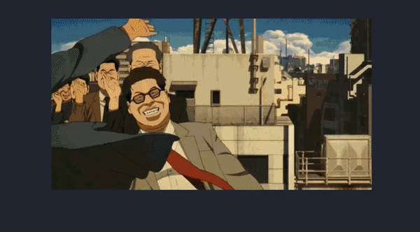
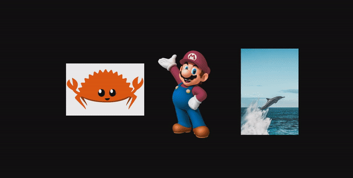
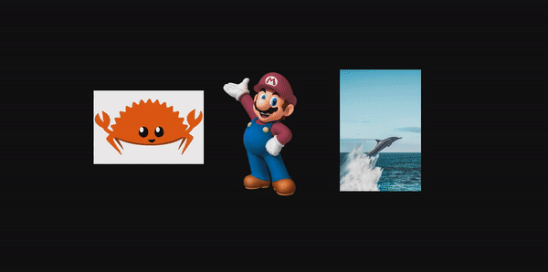
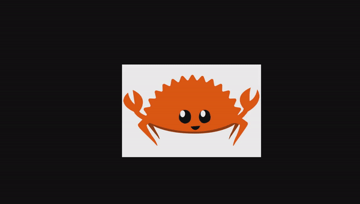
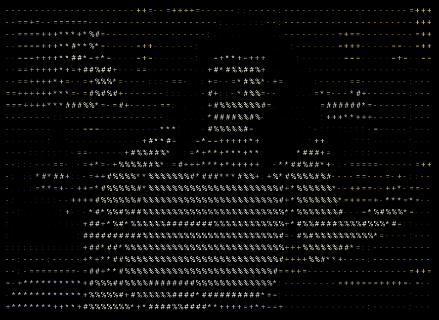

``` 
 ______     ______     ______     __     __     ______   __  __    
/\  __ \   /\  ___\   /\  ___\   /\ \   /\ \   /\  ___\ /\ \_\ \   
\ \  __ \  \ \___  \  \ \ \____  \ \ \  \ \ \  \ \  __\ \ \____ \  
 \ \_\ \_\  \/\_____\  \ \_____\  \ \_\  \ \_\  \ \_\    \/\_____\ 
  \/_/\/_/   \/_____/   \/_____/   \/_/   \/_/   \/_/     \/_____/ 
                                                                   
 ```

A commandline tool that converts images and gifs into ascii art that can be printed to the 
terminal or saved as a new file. 

Supported file formats:
* JPEG/JPG
* PNG
* GIF

# Installation

## Download on MacOS via homebrew

1. `brew tap JosephAdamson/asciify`
2. `brew install asccify`


## Download locally to MacOS

1. Clone repo.
2. cd into project director of download. 
3. To build executable run `cargo build --release`.
4. Remove the unidentified dev attribute from the executable with `sudo xattr -d com.apple.quarantine <asciify executable>`.
5. Allow read and execute permissions with `sudo chmod a+rx <asciify executable>`.
6. Move to your local bin directory with `sudo mv <asciify executable> /usr/local/bin`.
5. Congratualtions, you can now use the 'asciify' command from your command line. Try asciify -h to get started.

# Basic usage
Simply follow the command with the path to the file(s) you want converted.
```
asciify <image file paths>
```



Supports multiple file path/url arguments.
```
asciify <file_1, file_1 ...>
```



# Flags

### --color or -c
Display images/gifs with their original color.
> **Note:** To use this feature you terminal appication MUST support 24-bit or 8-bit colors, coloring will default to
> [truecolor](https://gist.github.com/CMCDragonkai/146100155ecd79c7dac19a9e23e6a362) if availble else 8-bit ansi color
> codes will be used.
```
asciify <image file paths> --color

asciify <image file paths> -c
```



### --detailed or -d
Allow pixel output intensity to be encoded with a wider range of characters (70 as opposed to the default 10).
```
asciify <image file paths> --detailed

asciify <image file paths> -d
```


### --mapping or -m
Provide a custom character string which will be used to encode the pixel intensities of the resulting image.
```
asciify <image file paths> --mapping <custom string>

asciify <image file paths> -m <custom string>
```



### --scale-factor or -s
> **Note:** Preserves size ratio of original image. Scale variable is only applied to the longest 
> out of height and width.
```
asciify <image file paths> --scale-factor <integer scale>

asciify <image file paths> -m <integer scale>
```


### --save
>**Note:** the output file format will correspond to the original file
> **e.g. my_file.gif -> asciify-my_file.gif**
Save output to file.
```
asciify <image file path> --save
```
Supports multiple file args (each file will be saved to their own corresponding output file).
```
asciify <file_1, file_1 ...> --save
```



